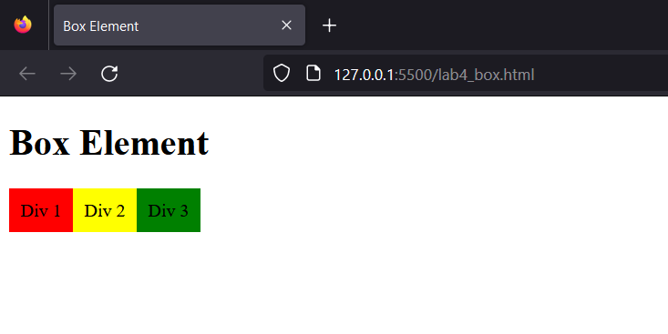
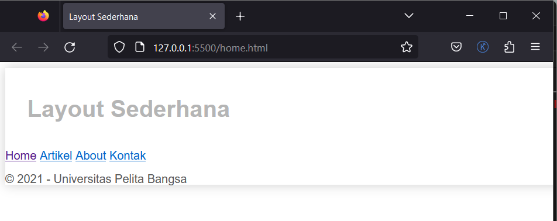

#Praktikum_web_4

`Nama  : Faizah Via Fadhillah`

`Nim   : 312210460`

`Kelas : TI22.A4`

## Web Layout

    Web layout merupakan kerangka yang mengatur penempatan tata letak sebuah elemen pada
    halaman web. 
    Tata letak element seperti navigasi, header, tombol CTA (Call to Action), dan elemen
    lainnya pada halaman web, sehingga tampilan web dapat disesuaikan dengan desain yang ada.
    Dengan layout website yang tepat, informasi akan tampil dengan lebih menawan dan fungsional.
    Halaman web sering kali dibagi menjadi header, menu, konten, dan footer: Ada banyak sekali
    desain tata letak yang dapat dipilih.

## Box Element 

    Element HTML dapat dianggap sebagai sebuah Box atau kotak. Box tersebut digunakan untuk
    membuat layout web. 
    Pada dasarnya semua element HTML adalah box dengan beberapa perbedaan.
    Ada yang floating ada juga yang tanpa floating.
    Tag yang biasanya digunakan dalam merancang layout web adalah tag div dengan konsep box element. 
    Konsep box element terdiri dari Margin, Border, Padding, dan Content.

## CSS Float Property

    CSS Float Property memungkinkan elemen HTML dibuat seolah-olah mengambang diantara elemen yang lainnya. 
    Dengan konsep tersebut dapat dengan mudah menentukan posisi atau letak sebuah elemen HTML. 
    Sehingga dalam membuat layout web dapat dengan mudah dilakukan.
    Property yang digunakan untuk mendefinisikan adalah (float) dan (clear).


## Praktikum 4 

# Membuat Box Element

1. Membuat Box Element

    Script HTML:

    ```html
    <section>
        <div class="div1">Div 1</div>
        <div class="div2">Div 2</div>
        <div class="div3">Div 3</div>
    </section>
    ```

    Script CSS:

    ```css
    div {
        float:left;
        padding: 10px;
    }
    .div1 {
        background: red;
    }
    .div2 {
        background: yellow;
    }
    .div3 {
        background: green;
    }
    ```

    Output:

    


2. Mengatur Clearfix Element

    Script HTML:

    ```html
    <section>
        <div class="div1">Div 1</div>
        <div class="div2">Div 2</div>
        <div class="div3">Div 3</div>
        <div class="div4">Div 4</div>
    </section>
    ```

    Script CSS:

    ```css
    .div4 {
        background-color: blue;
        clear: left;
        float: none;
    }
    ```

    Output:

    


# Membuat Layout Sederhana

1. Membuat Kerangka Layout

    Script:

    ```html
    <header>
        <h1>Layout Sederhana</h1>
    </header>
    <nav>
        <a href="home.html" class="active">Home</a>
        <a href="artikel.html">Artikel</a>
        <a href="about.html">About</a>
        <a href="kontak.html">Kontak</a>
    </nav>
        <section id="hero"></section>
        <section id="wrapper">
        <section id="main"></section>
        <aside id="sidebar"></aside>
    </section>
    <footer>
        <p>&copy; 2021 - Universitas Pelita Bangsa</p>
    </footer>
    ```

    Output:

    


2. Menambahkan Code CSS

    Script:

    ```css
    /* import google font */
    @import
    url('https://fonts.googleapis.com/css2 family=Open+Sans:ital,wght@0,300;0,400;0,600;0,700;0,800;1,300;1,400;1,600;1,700;1,800&display=swap');
    @import
    url('https://fonts.googleapis.com/css2?family=Open+Sans+Condensed:ital,wght@0,300;0,700;1,300&display=swap');

    /* Reset CSS */
    * {
        margin: 0;
        padding: 0;
    }
    body {
        line-height:1;
        font-size:100%;
        font-family:'Open Sans', sans-serif;
        color:#5a5a5a;
    }
    #container {
        width: 980px;
        margin: 0 auto;
        box-shadow: 0 0 1em #cccccc;
    }
    /* header */
    header {
        padding: 20px;
    }
    header h1 {
        margin: 20px 10px;
        color: #b5b5b5;
    }
    ```

    Output:

    


3. Membuat Navigasi

    Script:

    ```css
    /* navigasi */
    nav {
        display: block;
        background-color: #1f5faa;
    }
    nav a {
        padding: 15px 30px;
        display: inline-block;
        color: #ffffff;
        font-size: 14px;
        text-decoration: none;
        font-weight: bold;
    }
    nav a.active,
    nav a:hover {
        background-color: #2b83ea;
    }
    ```

    Output:

    


4. Membuat Hero Panel

    Script HTML:

    ```html
    <section id="hero">
        <h1>Hello World!</h1>
        <p>Lorem ipsum dolor sit amet, consectetur adipiscing elit. Vestibulum lorem
        elit, iaculis innisl volutpat, malesuada tincidunt arcu. Proin in leo fringilla,
        vestibulum mi porta, faucibus felis. Integer pharetra est nunc, nec pretium nunc
        pretium ac.</p>
        <a href="home.html" class="btn btn-large">Learn more &raquo;</a>
    </section>
    ```

    Script CSS:

    ```css
    /* Hero Panel */
    #hero {
        background-color: #e4e4e5;
        padding: 50px 20px;
        margin-bottom: 20px;
    }
    #hero h1 {
        margin-bottom: 20px;
        font-size: 35px;
    }
    #hero p {
        margin-bottom: 20px;
        font-size: 18px;
        line-height: 25px;
    }
    ```

    Output:

    


5. Membuat Sidebar Widget

    Script HTML:

    ```html
    <aside id="sidebar">
    <div class="widget-box">
        <h3 class="title">Widget Header</h3>
        <ul>
            <li><a href="#">Widget Link</a></li>
            <li><a href="#">Widget Link</a></li>
            <li><a href="#">Widget Link</a></li>
            <li><a href="#">Widget Link</a></li>
            <li><a href="#">Widget Link</a></li>
        </ul>
    </div>
    <div class="widget-box">
        <h3 class="title">Widget Text</h3>
        <p>Vestibulum lorem elit, iaculis in nisl volutpat, malesuada tincidunt
        arcu. Proin in leo fringilla, vestibulum mi porta, faucibus felis. Integer
        pharetra est nunc, nec pretium nunc pretium ac.</p>
    </div>
    </aside>
    ```

    Script CSS:

    ```css
    /* widget */
    .widget-box {
        border:1px solid #eee;
        margin-bottom:20px;
    }
    .widget-box .title {
        padding:10px 16px;
        background-color:#428bca;
        color:#fff;
    }
    .widget-box ul {
        list-style-type:none;
    }
    .widget-box li {
        border-bottom:1px solid #eee;
    }
    .widget-box li a {
        padding:10px 16px;
        color:#333;
        display:block;
        text-decoration:none;
    }
    .widget-box li:hover a {
        background-color:#eee;
    }
    .widget-box p {
        padding:15px;
        line-height:25px;
    }
    ```

    Output:

    


6. Mengatur Footer

    Script CSS

    ```css
    /* footer */
    footer {
        clear:both;
        background-color:#1d1d1d;
        padding:20px;
        color:#eee;
    }
    ```

    Output:

    


7. Menambahkan Elemen lainnya pada Main Content

    Script HTML:

    ````html
    <section id="main">
        <div class="row">
            <div class="box">
                
                <h3>Heading</h3>
                <p>Donec sed odio dui. Etiam porta sem malesuada magna mollis
                euismod.</p>
                <a href="#" class="btn btn-default">View detail</a>
        </div>
        <div class="box">
                
                <h3>Heading</h3>
                <p>Donec sed odio dui. Etiam porta sem malesuada magna mollis
                euismod.</p>
                <a href="#" class="btn btn-default">View detail</a>
        </div>
        <div class="box">
                
                <h3>Heading</h3>
                <p>Donec sed odio dui. Etiam porta sem malesuada magna mollis
                euismod.</p>
                <a href="#" class="btn btn-default">View detail</a>
        </div>
        </div>
    </section>
    ```
    Script CSS:

```css
    /* box */
    .box {
        display:block;
        float:left;
        width:33.333333%;
        box-sizing:border-box;
        -moz-box-sizing:border-box;
        -webkit-box-sizing:border-box;
        padding:0 10px;
        text-align:center;
    }
    .box h3 {
        margin: 15px 0;
    }
    .box p {
        line-height: 20px;
        font-size: 14px;
        margin-bottom: 15px;
    }
    .box img {
        border: 0;
        vertical-align: middle;
    }
    .image-circle {
        border-radius: 50%;
    }
    .row {
        margin: 0 -10px;
        box-sizing: border-box;
        -moz-box-sizing: border-box;
        -webkit-box-sizing: border-box;
    }
    .row:after, .row:before,
    .entry:after, .entry:before {
        content:'';
        display:table;
    }
    .row:after,
    .entry:after {
        clear:both;
    }

```

    Output:
    


8. Menambahkan Content Artikel

    Script HTML:

    ```html
    <hr class="divider" />
    <article class="entry">
        <h2>First featurette heading.</h2>
        
        <p>Lorem ipsum dolor sit amet, consectetur adipiscing elit. Vestibulum lorem
        elit, iaculis in nisl volutpat, malesuada tincidunt arcu. Proin in leo fringilla,
        vestibulum mi porta, faucibus felis. Integer pharetra est nunc, nec pretium nunc
        pretium ac.</p>
    </article>
        <hr class="divider" />
        <article class="entry">
        <h2>First featurette heading.</h2>
        
        <p>Lorem ipsum dolor sit amet, consectetur adipiscing elit. Vestibulum lorem
        elit, iaculis in nisl volutpat, malesuada tincidunt arcu. Proin in leo fringilla,
        vestibulum mi porta, faucibus felis. Integer pharetra est nunc, nec pretium nunc
        pretium ac.</p>
    </article>
    ```

    Script CSS:

    ```css
    .divider {
        border:0;
        border-top:1px solid #eeeeee;
        margin:40px 0;
    }
    /* entry */
    .entry {
        margin: 15px 0;
    }
    .entry h2 {
        margin-bottom: 20px;
    }
    .entry p {
        line-height: 25px;
    }
    .entry img {
        float: left;
        border-radius: 5px;
        margin-right: 15px;
    }
    .entry .right-img {
        float: right;
    }
    ```

    Output:

    

# Tugas

1. Tambahkan Layout untuk menu About

    Output: 

    


2. Tambahkan layout untuk menu Contact

    Output:

    

